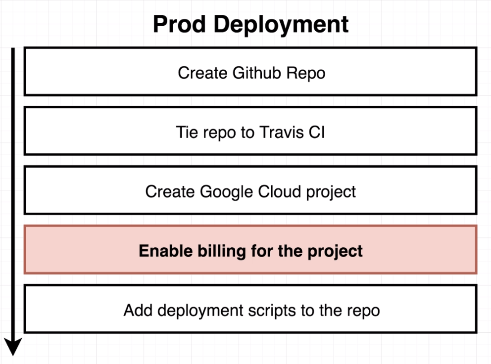
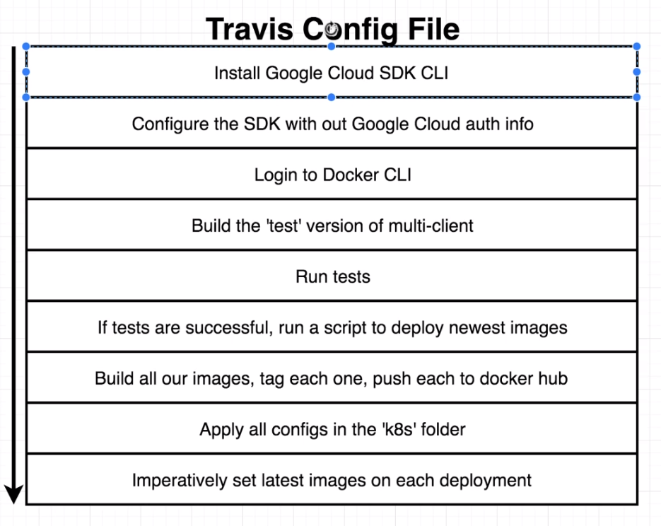
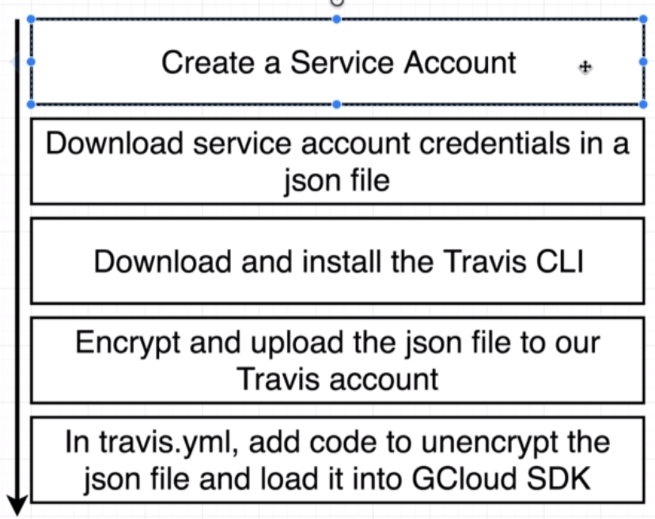
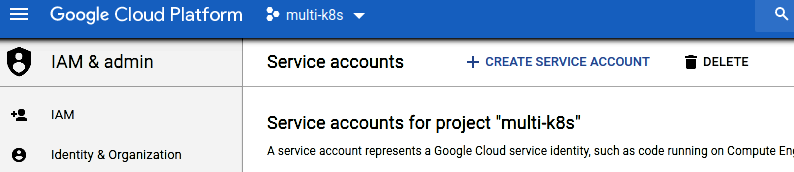
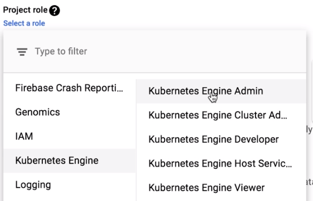
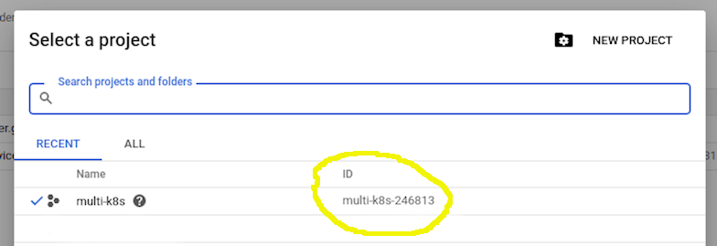
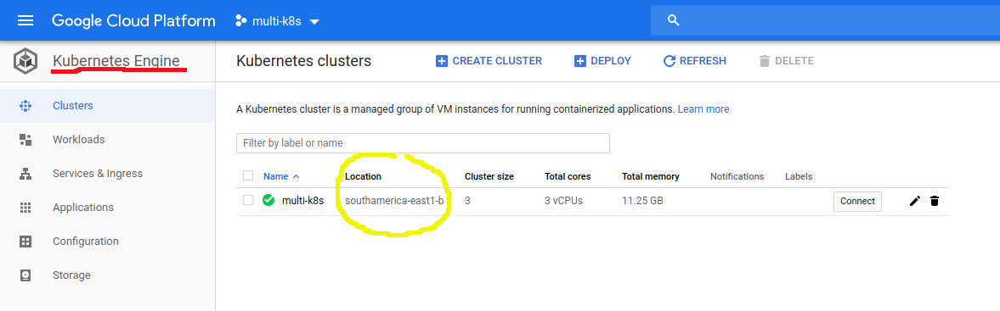
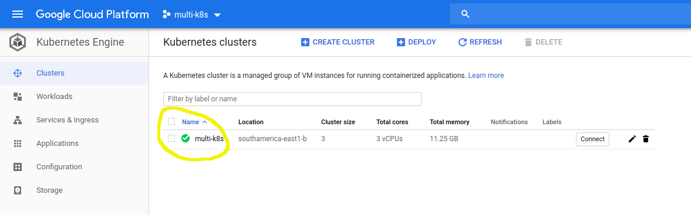

Essa documentação tem o objetivo de criar um projeto e rodá-lo em um cluster kubernetes no GCP do zero. A sequência adotada será a seguinte:
<body>
	<center>
        
	</center>
</body>

# Criando um projeto no GCP

- Antes de criar o projeto pode-se verificar o custo médio do projeto usando a calculadora do GCP: https://cloud.google.com/products/calculator/
- Acessar o console do GCP em https://console.cloud.google.com
- Clicar em `Projects`, irá abrir uma nova janela, clicar em "NEW PROJECT" dar o nome ao projeto e criar
- Habilitar a Cobrança para o projeto recém criado
    - No menu de navegação(Canto superior esquerdo) encontrar e clicar no item `Billing`
    - Em Billing selecionar `Link a billing account`, selecionar a conta de cobrança para o projeto e clicar em `SET ACCOUNT`

# Criando o cluster kubernetes

- No menu de navegação ir até a seção `COMPUTE` e selecionar o item `Kubernetes Engine`
- Irá abrir uma nova página carregando a função no projeto, pode demorar um pouco.
<p>
    **NOTA** no canto superior direito, próximo à imagem do titular da conta haverá um ícone com a imagem de um sino que terá uma barra de progresso girando em torno. Essa informação é mais confiável do que a informação de progresso que aparece no centro da tela.
</p>
- Assim que o serviço estiver habilitado podemos clicar em `Create Cluster` na janela que terá no centro da tela.
- Ná página que abrirá selecionar as características desejadas para o novo cluster, ao concluir clique em create.
- Assim que a criação do cluster for concluída vc poderá acessar o cluster clicando nele
- No canto esquerdo da tela teremos o menu do cluster onde poderemos verificar e configurar suas características(storage classes, ingress, workloads...).
- Em Storage temos os Storage Classes que por padrão vem com um persistent disk.

# Preparando o GITLAB/TRAVIS

Nesta etapa começaremos a preparar a parte de CI/CD do projeto, seguiremos o seguinte cronograma:
<body>
	<center>	
		
	</center>
</body>

- A primeira necessidade é instalar o CLI do GCP SDK no projeto, para isso colocaremos na seção `before_install` do nosso arquivo de configuração do projeto(`.gitlab-ci.yaml` ou `.travis.yml`) a seguintes linhas de comando:

```sh
...
  - curl https://sdk.cloud.google.com | bash -s -- --disable-prompts > /dev/null;
  - source $HOME/google-cloud-sdk/path.bash.inc
...
```

- Precisamos também instalar o `kubectl` no nosso cluster para que possamos rodar comandos direto da interface CLI do cluster, para ainda na seção `before_install` do nosso arquivo de configuração do projeto iremos inserir a seguinte linha:

```sh
...
  - gcloud components update kubectl
...
```
 - O próximo passo é passar as informações de login do GCP para o projeto, faremos isso adicionando a linha:
 ```sh
...
  - gcloud auth activate-service-account --key-file service-account.json
...
```

### Criando a conta de serviço para o projeto e adicionando ao TRAVIS/GITLAB

<body>
	<center>	
		
	</center>
</body>

 - No menu de navegação do GCP ir até a seção `IAM & admin`
 - Na página que se abrirá, lado esquerdo da tela selecionar `Service accounts`
 - Na parte central, superior clicar em `+CREATE SERVICE ACCOUNT`
 <body>
	<center>	
		
	</center>
</body>

- Na janela que abrir preencher as informações de `nome`, `service account ID`e `description` e clicar em `Create`
- Na próxima página, no item `Select a role` escolher `Kubernetes Engine` -> `Kubernetes Engine Admin` e clicar em `CONTINUE`
<body>
	<center>	
		
	</center>
</body>

**NOTA** é possível criar várias roles diferentes.

- Na próxima página clicar em `+ CREATE KEY`, selecionar o formato `JSON` e `CREATE`

**Será criada uma chave para ser baixada para a estação local**

**IMPORTANTE:**
Esta chave contém informações sensíveis do projeto e não deve, em hipótese alguma ser exposta. No próximo passo iremos criptografar esta chave com o intuito de proteger seu conteúdo no nosso repositório.

### Download e Instalação do Travis CLI para criptografar a chave recém baixada

Essa ferramenta do TRAVIS requer o ruby instalado no sistema. Para que não seja preciso a instalação do ruby faremos isso através de um container docker. Os comandos abaixo servem para executar esse passo.

- Baixe o container `ruby` e compartilhe o diretório local para poder acessar a chave json.
```sh
$ docker run -it -v $(pwd):/app ruby:2.3 sh
```
- Vá para dentro do diretório app do container
```sh
# cd app/
```
- Instale o `Travis CLI` no container
```sh
# gem install travis
```
- Faça login na sua conta do travis
```sh
# travis login
```
- Criptografe o arquivo da chave json(renomeada para `service-account.json`) baixado do GCP
```sh
...
# travis encrypt-file service-account.json -r <owner>/<repo>
...
```
- A saída deste último comando irá gerar um novo comando, semelhante ao comando abaixo, que iremos copiar para colocar no início da seção `before_install` do nosso `.travis.yaml`.

```sh
...
- openssl aes-256-cbc -K $encrypted_42099b4af021_key -iv $encrypted_42099b4af021_iv -in service-account.json.enc -out service-account.json -d
...
```

### Informando o caminho para o projeto no GCP
- Agora precisaremos informar ao travis qual o caminho para o projeto no GCP que deverá ser seguido. Ainda na seção `before_install` iremos passar o seguinte comando:
```sh
...
- gcloud config set project <Project ID>
...
```
<body>
	<center>	
		
	</center>
</body>

```sh
...
- gcloud config set compute/zone <AZ do cluster>
...
```
<body>
	<center>	
		
	</center>
</body>

```sh
...
- gcloud container clusters get-credentials <nome do cluster>
...
```
<body>
	<center>	
		
	</center>
</body>

### Informando o repositório de imagens
**NOTA**<br>
Para a confecção dessa documentação foi utilizado um repositório público.
<p>

- Ainda na seção `before_install` iremos passar o seguinte comando:

```sh
...
- echo "$DOCKER_PASSWORD" | docker login -u "$DOCKER_USERNAME" --password-stdin
...
```
**OBS.:** As variáveis `$DOCKER_PASSWORD` e `$DOCKER_USERNAME` devem ser informadas no travis/gitlab como variáveis de ambiente.

# *Atenção*
O restante da configuração do aruqivo de CI(env, testes, execução...) depende do deploy que se deseja rodar. As considerações da etapa a seguir são expecíficas do deploy implementado para teste.

### Testando e construindo a aplicação

Para nos certificarmos do funcionamento do deploy iremos rodar um teste automatizado antes de subirmos o projeto no cluster, portanto como último comando da seção `before_install` teremos:

```sh
...
- docker build -t ladis29/react-test -f ./client/Dockerfile.dev ./client
...
```

Iremos agora criar a seção `script` do nosso CI e rodar o comando de execução.

```sh
...
script:
  - docker run -e CI=true ladis29/react-test npm test -- --coverage
...
```
- Criaremos então o nosso deploy baseado na seção `script`
```sh
...
deploy:
  provider: script
  script: bash ./deploy.sh
  on:
    branch: master
...
```

### *deploy.sh*
Este arquivo foi criado para executar a construção das imagens e exportação das mesmas para o registro de imagem selecionado, porém para evitar que as imagens sempre tenham a tag `latest` iremos criar a tag em cada interação com o GIT usando a variável `SHA` gerada.
Para isso iremos criar a variável de ambiente **NO ARQUIVO CI** informando essa variável:

```sh
...
env:
  global:
    - SHA=$(git rev-parse HEAD)
...
```
Como o processo é todo automatizado não será possível responder à eventuais "prompts" gerados no processo, para tanto vamos inserir na seção `env - global` o comando para desabilitar os eventuais prompts que possam surgir.

```sh
...
- CLOUDSDK_CORE_DISABLE_PROMPTS=1
...
```
## Váriáveis específicas do projeto
Algumas variáveis desse projeto serão, **à título de estudo** , informadas ao cluster via linha de comando através da ferramenta GCP CLOUD SHELL.

- No console do projeto no GCP iremos clicar sobre o ícone da ferramenta na parte superior direita da janela:
<body>
	<center>	
		
	</center>
</body>

Para que possamos usar o cloud shell para aplicar comandos no nosso cluster/projeto teremos que informar no shell as mesmas variáveis informadas no nosso arquivo de CI. Para isso, nesse caso, iremos inserir os comandos:
```sh
$ gcloud config set project	multi-k8s-246813
$ gcloud config set compute/zone southamerica-east1-b
$ gcloud container clusters get-credentials multi-k8s

```
## HELM
Instalaremos as ferramenta `helm` e `Tiller` no cluster para facilitar parte do processo de gerenciamento do cluster.

Para isso iremos instalar o helm via GCP CLOUD SHELL como recomendado na documentação oficial da ferramenta (https://helm.sh/docs/using_helm/#from-script) .

```sh
$ curl -LO https://git.io/get_helm.sh
$ chmod 700 get_helm.sh
$ ./get_helm.sh
```

**NOTA -** Não rodar o helm init ainda.

Em um cluster GCP o RBAC é automaticamente instalado e ativado na criação do cluster. 

- Para que possamos instalar o Tiller e permitir sua correta execução teremos que criar a `Service Account`  par ao tiller através do comando:
```sh
$ kubectl create serviceaccount --namespace kube-system tiller
```

- Com a service account criada vamos definir o acesso dessa service account criando o `ClusterRoleBinding` com o comando:
```sh
$ kubectl create clusterrolebinding tiller-cluster-rule --clusterrole=cluster-admin --serviceaccount=kube-system:tiller
```
- Rodar o helm init informando o service account do tiller
```sh
$ helm init --service-account tiller --upgrade
```


## NGINX

A configuração nginx usada nesse projeto terá por base a configuração recomendada pelo repositório https://github.com/kubernetes/ingress-nginx

- No topo da página do repositório temos o link para a página do projeto: https://kubernetes.github.io/ingress-nginx/

- No cabeçalho da página encontramos a seção `Deployment` que contém o guia para vários deploys diferentes.

- No caso deste projeto usaremos o `helm`.
```sh
$ helm install stable/nginx-ingress --name my-nginx --set rbac.create=true
```

# Skaffold

O skaffold essencialmente, explicando de uma amneira bem sucinta, é uma ferramenta de linha de comandos, separada do kubernetes, mas feita para ser usada com o kubernetes com o intuito de facilitar o desenvolvimento mapeando/compartilhando um volume local com o cluster(assim como é feito com o docker).

Ele monitora o diretório local indicado e assim que percebe alguma alteração ele as reflete no cluster, pode fazer isso de duas maneiras diferentes:
- Reconstruindo completamente a imagem que sofreu alterações(docker level)
- Injetando os arquivos alterados no pod de destino e promovendo uma atualização do pod(porém o pod deve estar rodando de maneira a perceber a atualização e se auto-atualizar).


### Instalação

A instalação do skaffold é feita na estação de trabalho local e depende do sistema operacional em que iremos efetuá-la. Instruções mais detalhadas para a instalação são encontradas em https://skaffold.dev/docs/getting-started.

Para verificar se o skaffold está instalado na sua estação rode o comando
```sh
$ skaffold version
```


### Config File

No diretório raiz do projeto deverá ser criado um `yaml` com as configurações do skaffold chamado de `skaffold.yaml`.

Todas as referências para a criação deste arquivo estão na página da ferramenta https://skaffold.dev/docs/references/yaml

teste de integração git x code